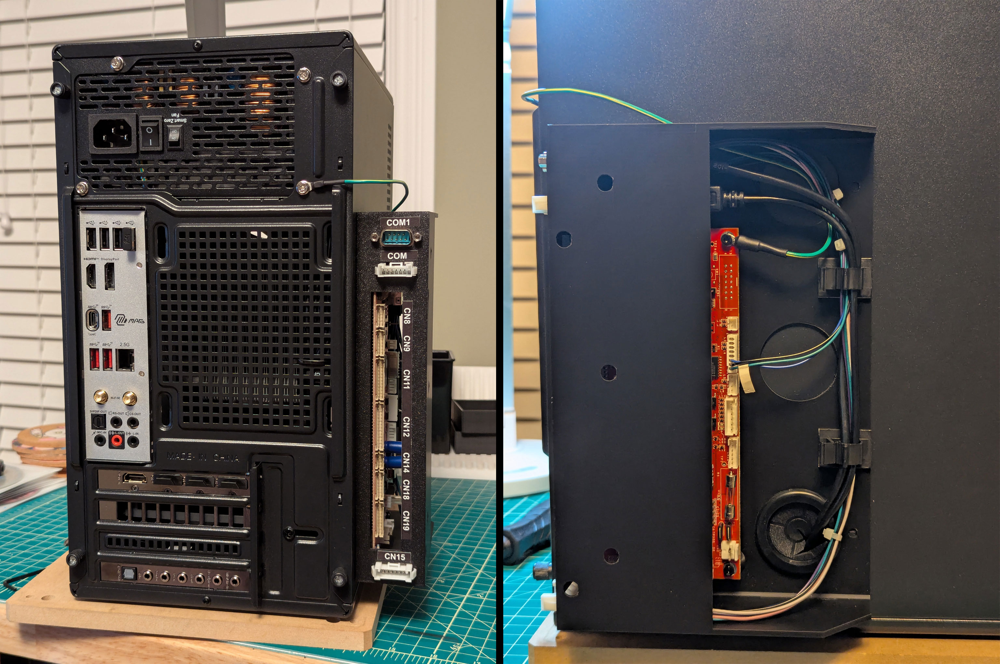

Simple case to hold a BIO2 board for use with IIDX (BI2A). Includes 38mm hoels to allow passing wires into PC case via a grommet.

Note: The M3 standoffs are on the looser side - consider some grip strips or locktite to keep the board secure.
